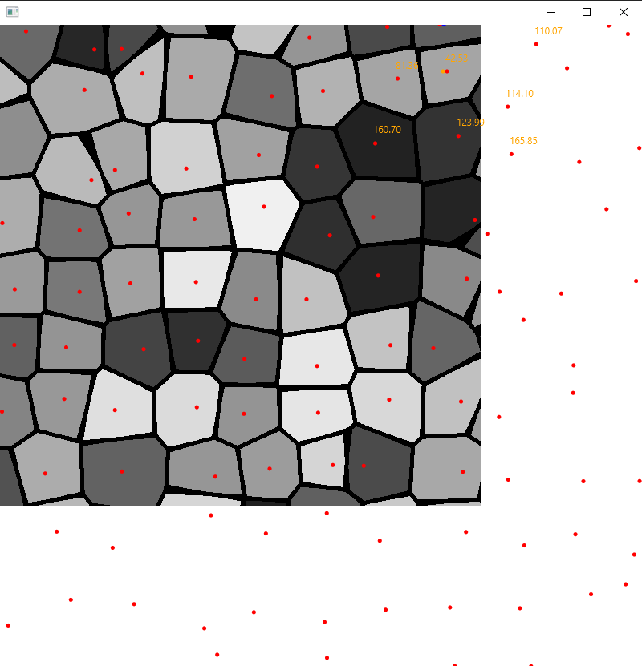

### JVoronoi

---

This library contains a naive implementation of Voronoi/Worley noise. 
I wrote it because I needed to split biomes into cells, while placing borders between each cell.

A demo GUI is available under the `test` module:



### Usage

JVoronoi uses a grid system for cell sizes. The size of a grid roughly corresponds to the size of the output cells.
In the following example, a grid size of 80 with a canvas size of 400x400 results in ~6x6 cells on each axis.

```java
JVoronoi voronoi = new JVoronoi(0, 80); // seed, grid size
for(int x = -0; x < 400; x++) {
    for (int y = -0; y < 400; y++) {
        double eval = voronoi.tesselateWithEdge(x, y, 5); // x, y, spacing
    }
}
```

---

### Attribution

JVoronoi uses [KdotJPG's OpenSimplex2](https://github.com/KdotJPG/OpenSimplex2/blob/master/UNLICENSE) for cell value assignment. 
OpenSimplex2 is provided under [The Unlicense](https://github.com/KdotJPG/OpenSimplex2/blob/master/UNLICENSE). 
Thank you to KdotJPG for your contributions to this field and the fantastic library!

### License

JVoronoi is licensed under MIT.